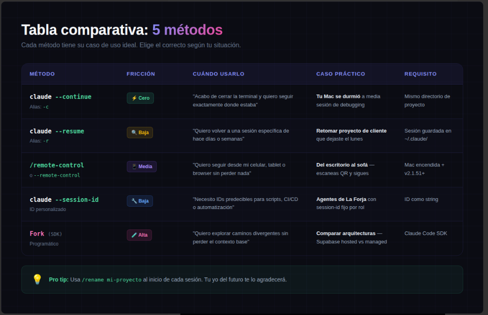
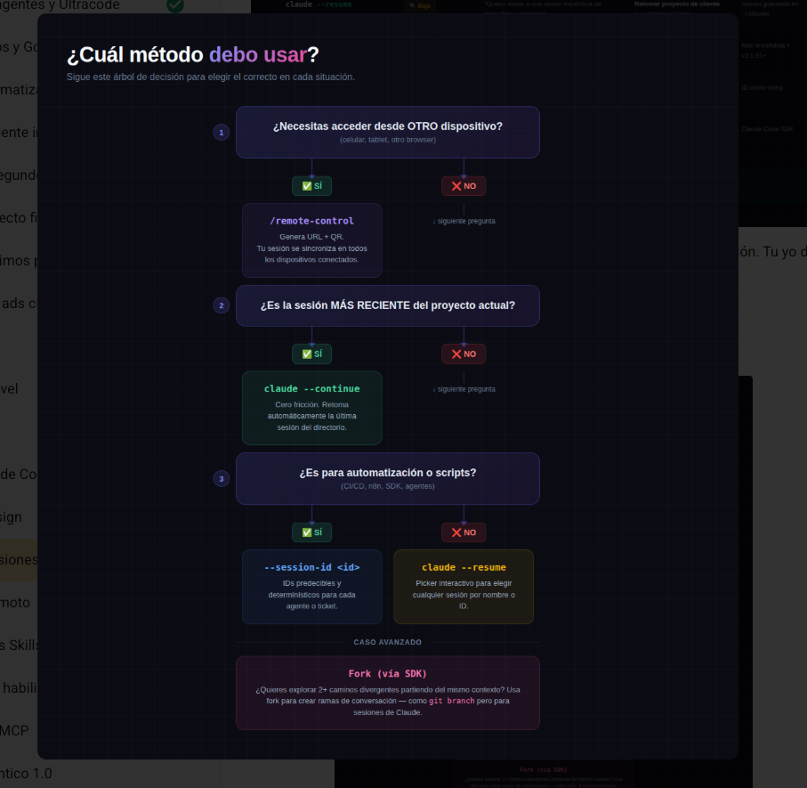
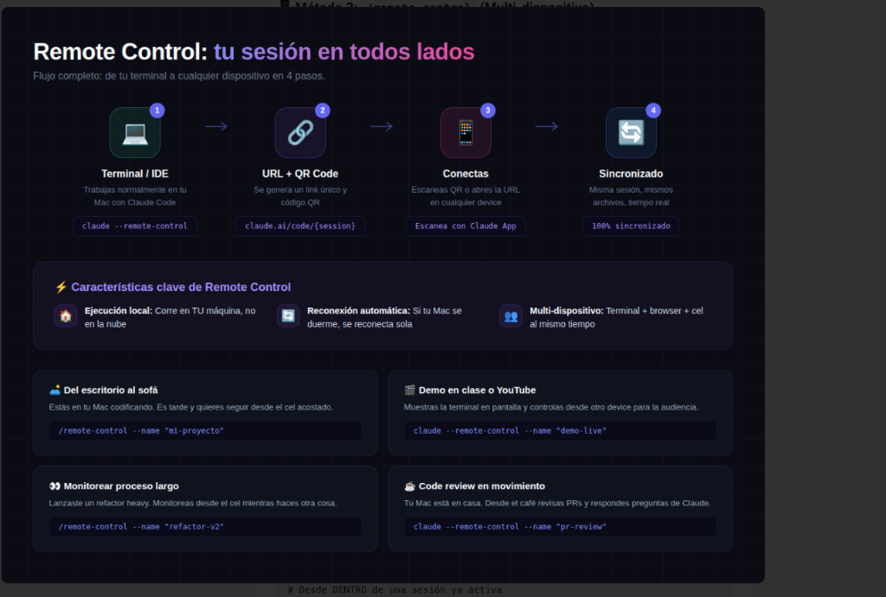
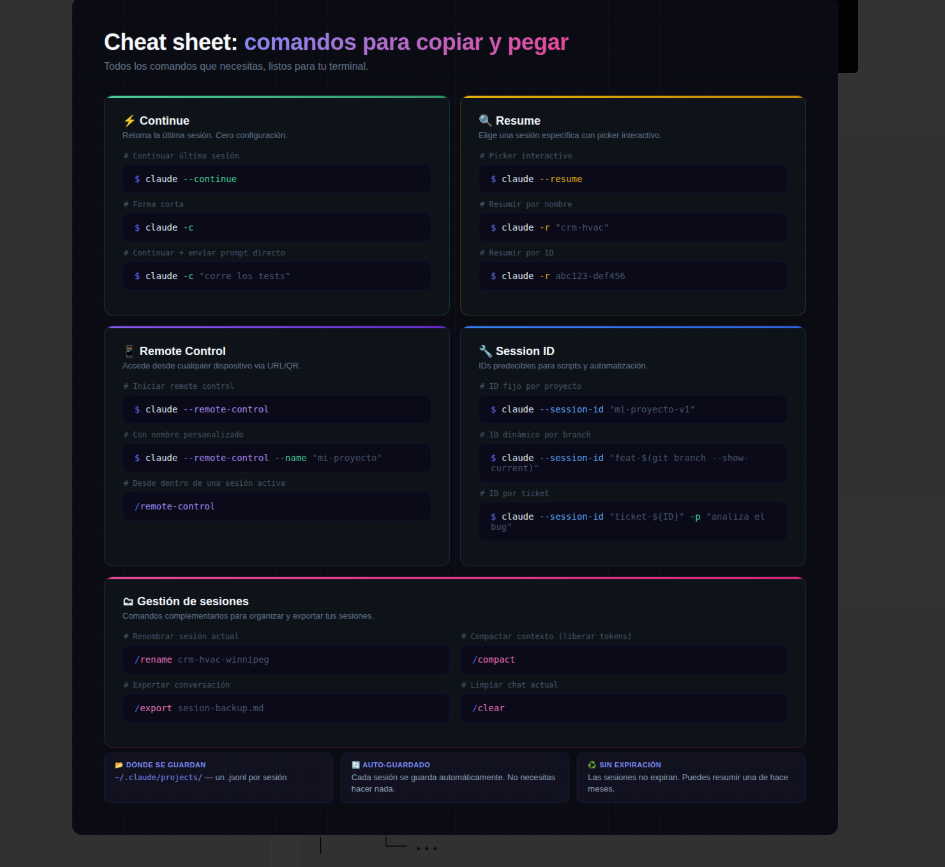

# Bono: Gestión de Sesiones — 5 Métodos de Persistencia y Multi-dispositivo

Cerrar la terminal tras una sesión intensa de desarrollo y tener que volver a explicar todo el contexto desde cero es uno de los problemas más comunes al usar agentes CLI. Claude Code incluye 5 métodos nativos para persistir, retomar, bifurcar y compartir sesiones en tiempo real entre terminal, desktop y celular.

---

## 📊 Vista general: Los 5 métodos



| Método | Fricción | Cuándo usarlo | Caso práctico | Requisito |
|--------|----------|---------------|---------------|-----------|
| **`claude --continue`** (alias `-c`) | Cero ⚡ | "Acabo de cerrar la terminal y quiero seguir exactamente donde estaba" | Tu Mac/PC se durmió a media sesión de debugging | Mismo directorio del proyecto |
| **`claude --resume`** (alias `-r`) | Baja 🔍 | "Quiero volver a una sesión específica de hace días o semanas" | Retomar proyecto de cliente que dejaste el lunes | Sesión guardada en `~/.claude/` |
| **`/remote-control`** (o `--remote-control`) | Media 📱 | "Quiero seguir desde mi celular, tablet o browser sin perder nada" | Del escritorio al sofá: escaneas QR y sigues desde la cama | Mac encendida + Claude Code v2.1.51+ |
| **`claude --session-id`** | Baja 🔧 | "Necesito IDs predecibles para scripts, CI/CD o automatización" | Agentes de La Forja con session-id fijo por rol | ID como string |
| **`Fork (SDK)`** | Alta 🧪 | "Quiero explorar caminos divergentes sin perder el contexto base" | Comparar arquitecturas (Supabase hosted vs managed) | Claude Code SDK |

> 💡 **Pro tip:** Usa siempre `/rename mi-proyecto` al inicio de cada sesión importante. Tu yo del futuro te lo agradecerá cuando tengas decenas de sesiones archivadas.

---

## 🌳 Árbol de decisión: ¿Cuál método debo usar?



1. **¿Necesitas acceder desde OTRO dispositivo (celular, tablet, browser)?**
   - **SÍ** → `/remote-control` (genera URL + código QR, sesión sincronizada en tiempo real).
   - **NO** → Pasa a la siguiente pregunta.
2. **¿Es la sesión MÁS RECIENTE del proyecto actual?**
   - **SÍ** → `claude --continue` (cero fricción, retoma automáticamente la última sesión del directorio).
   - **NO** → Pasa a la siguiente pregunta.
3. **¿Es para automatización o scripts (CI/CD, n8n, SDK, agentes)?**
   - **SÍ** → `claude --session-id <id>` (IDs predecibles y determinísticos para cada tarea).
   - **NO** → `claude --resume` (picker interactivo con buscador para elegir por nombre o ID).
4. **Caso avanzado: ¿Quieres explorar 2+ caminos divergentes del mismo contexto?**
   - → `Fork (vía SDK)` (crea ramificaciones estilo `git branch` para sesiones de Claude).

---

## ⚡ Método 1: `claude --continue` (Cero fricción)

Retoma la sesión más reciente del directorio actual con todo su contexto: archivos leídos, comandos ejecutados y stack traces analizados.

```bash
# Continuar última sesión del directorio actual
claude --continue

# Forma corta
claude -c

# Continuar + enviar prompt directo
claude -c "corre los tests otra vez"

# En modo no-interactivo (ideal para scripts)
claude -c -p "checa errores de TypeScript"
```

**Casos de uso:**
- **La máquina entra en sleep:** Vuelves a la terminal, ejecutas `claude -c` y continúas sin interrupción.
- **Workflow iterativo (TDD):** Ciclos de test → corrección → validación tras reiniciar la terminal.
- *Nota clave:* Si cambias de carpeta, `--continue` tomará la última sesión de esa otra carpeta.

---

## 🔍 Método 2: `claude --resume` (Picker interactivo)

Permite seleccionar y recuperar cualquier sesión histórica de tu máquina.

```bash
# Picker interactivo (navega con flechas y busca con '/')
claude --resume

# Forma corta
claude -r

# Resumir directamente por nombre asignado
claude -r "crm-hvac"

# Resumir por ID específico
claude -r abc123-def456

# Resumir + prompt directo
claude -r "crm-hvac" "revisa el último cambio"
```

**Casos de uso:**
- **Cambio de proyecto entre días:** Retomar el trabajo del lunes tras haber trabajado en otro proyecto el martes.
- **Recuperar decisiones arquitectónicas:** Buscar con `/` términos como `schema` o `auth` en el historial para consultar debates previos con Claude.

---

## 📱 Método 3: `/remote-control` (Multi-dispositivo en tiempo real)

Permite conectar cualquier navegador o celular a la sesión de Claude Code que se ejecuta en tu computador.



```bash
# Iniciar Remote Control desde una nueva sesión
claude --remote-control

# Con nombre personalizado (recomendado)
claude --remote-control --name "mi-proyecto"

# Desde dentro de una sesión activa
/remote-control

# Con nombre desde dentro
/remote-control --name "refactor-v2"
```

### Cómo funciona y diferencias con la web:
1. Se ejecuta el comando en la terminal local.
2. Genera una URL única y un código QR.
3. Desde el móvil: abres la app de Claude o `claude.ai/code` y seleccionas la sesión (indicada con ícono de computadora y punto verde 🟢).
4. **Detalle crítico:** A diferencia de Claude en la nube, Remote Control corre en **tu máquina local**. Tiene acceso directo a tus archivos, tu entorno y tu terminal. Si la máquina se duerme o pierde conexión, se reconecta automáticamente al volver online.

---

## 🔧 Método 4: `claude --session-id` (Automatización y Scripts)

Proporciona IDs determinísticos para scripts, pipelines de CI/CD o agentes multi-rol.

```bash
# ID fijo por proyecto o entorno
claude --session-id "mi-proyecto-v1"

# ID dinámico basado en la rama de Git
claude --session-id "feat-$(git branch --show-current)"

# ID asociado a tickets de soporte o issues
claude --session-id "ticket-${TICKET_ID}" -p "analiza el bug reportado"

# Agentes multi-rol con sesión propia
claude --session-id "forja-literal" "revisa este módulo con enfoque conservador"
claude --session-id "forja-creativo" "propón alternativas disruptivas"
```

---

## 🧪 Método 5: Fork de sesiones (Vía SDK)

Bifurca una conversación existente en múltiples ramas independientes para explorar soluciones alternativas sin alterar la sesión base.

```typescript
import { ClaudeCode } from '@anthropic-ai/claude-code';
const claude = new ClaudeCode();

// Sesión original: análisis de requerimientos
const original = await claude.query({
  prompt: "Analiza los requerimientos del proyecto NÚCLEO"
});

// Fork A: Explorar arquitectura self-hosted
const forkA = await claude.query({
  prompt: "Diseña la arquitectura con Supabase self-hosted en Coolify",
  fork: { session_id: original.session_id }
});

// Fork B: Explorar arquitectura managed cloud
const forkB = await claude.query({
  prompt: "Diseña la arquitectura con Supabase managed cloud",
  fork: { session_id: original.session_id }
});
```

---

## 📋 Cheat Sheet: Comandos de gestión



```bash
/rename nombre-descriptivo   # Asignar nombre para encontrarla fácilmente después
/export sesion-backup.md    # Exportar el transcript completo a Markdown
/compact                    # Compactar contexto cuando se acerque al límite
/clear                      # Limpiar chat y empezar sesión fresca
/history                    # Ver historial de la sesión
```

---

## 🗃️ Dónde se guardan las sesiones

Todas las sesiones residen localmente en `~/.claude/projects/`:

```
~/.claude/
└── projects/
    ├── tu-proyecto/
    │   ├── session-abc123.jsonl    ← Transcript completo del diálogo y tools
    │   ├── session-def456.jsonl
    │   ├── sessions-index.json     ← Índice y metadata de sesiones
    │   └── memory/
    │       └── MEMORY.md           ← Memoria persistente del proyecto
    └── otro-proyecto/
```

- **Auto-guardado:** No requiere guardado manual; cada turno se persiste en disco.
- **Sin expiración:** Las sesiones no caducan; puedes reanudar conversaciones de hace meses.
- **Restauración íntegra:** Recupera salidas de terminal, archivos leídos e historial de razonamiento.
- **Repositorios Git:** Las sesiones del mismo repo (incluyendo worktrees) se agrupan automáticamente.

---

## ⚠️ Errores comunes

| Error | Causa | Solución |
|-------|-------|---------|
| `--continue` abre la sesión incorrecta | La terminal se abrió en un directorio distinto | Asegurarse de ejecutar el comando en la raíz del proyecto correspondiente |
| Remote Control no conecta desde móvil | La computadora anfitriona está apagada o sin internet | Mantener la máquina encendida con conexión activa |
| Sesión imposible de ubicar en el picker | No se nombró la sesión | Adoptar la regla de ejecutar `/rename` en los primeros mensajes |
| Versión no compatible de Remote Control | Versión de Claude Code inferior a v2.1.51 | Actualizar el CLI ejecutando `npm install -g @anthropic-ai/claude-code@latest` |
